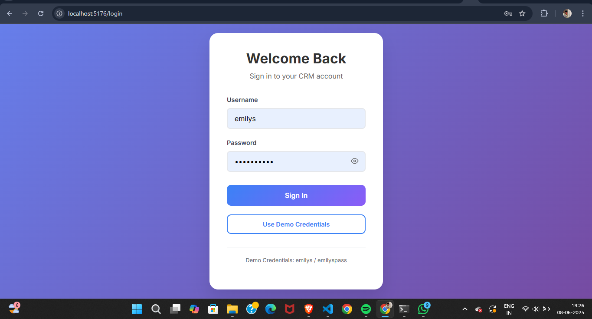
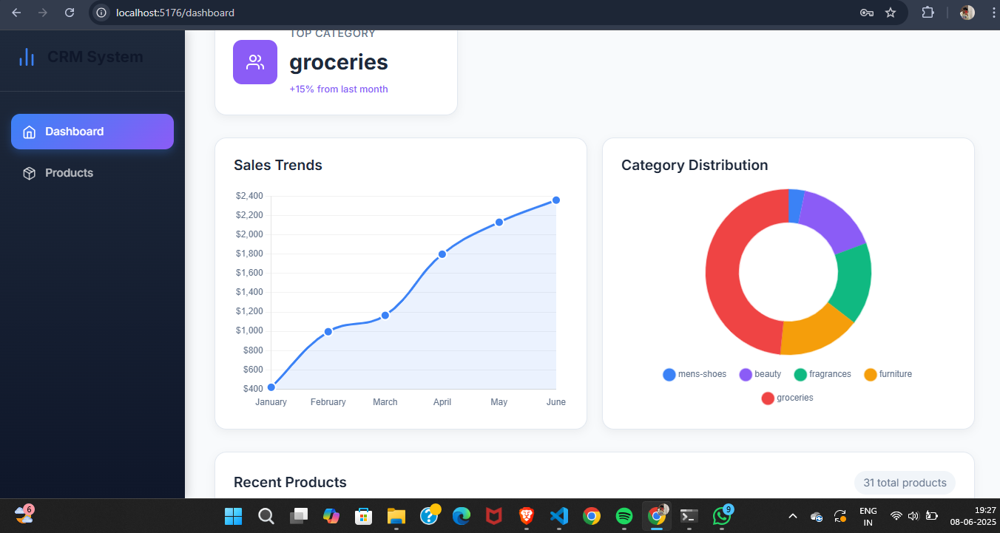
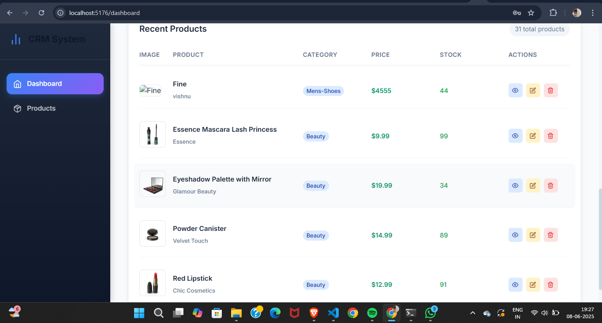
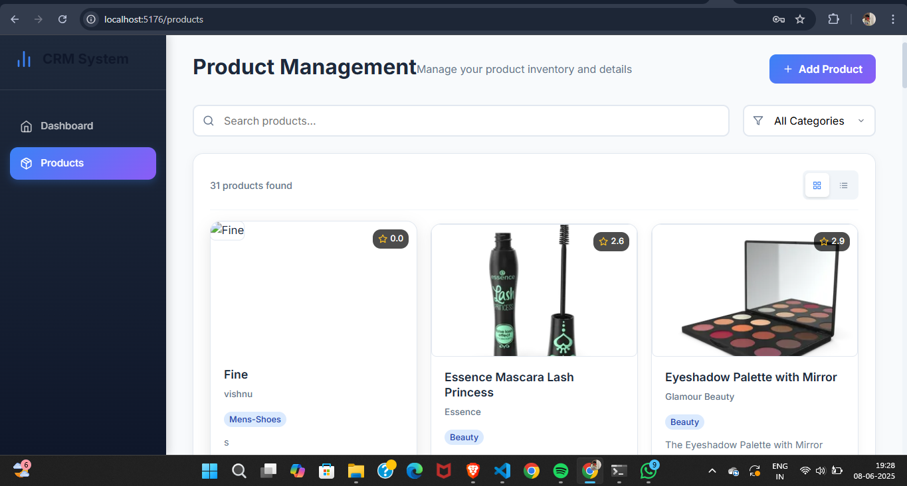
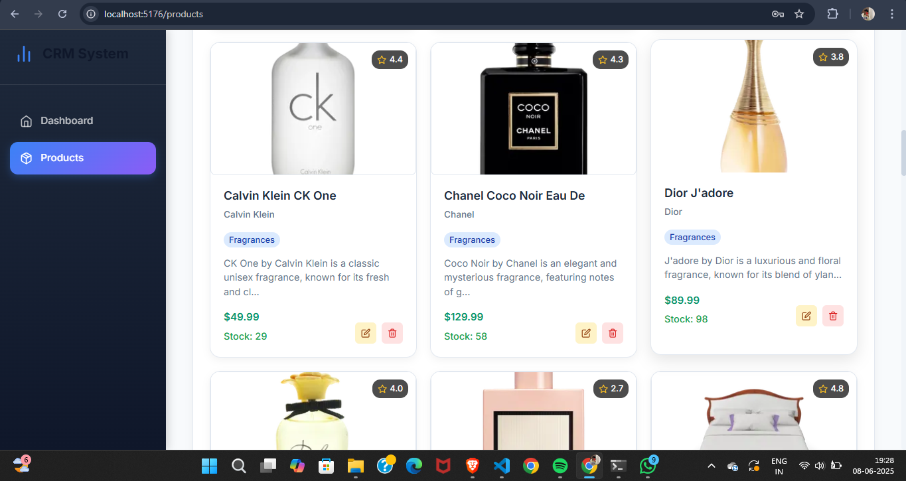

# CRM System Dashboard

A single-page CRM (Customer Relationship Management) dashboard application built with React.js, designed to manage product inventory and provide user authentication. This project demonstrates core web development concepts including state management, routing, API integration, and basic CRUD operations.

## ✨ Features

  * **User Authentication:** Secure login functionality with a dummy API.
  * **Protected Routes:** Implement public and private routing to restrict access to authenticated users.
  * **Interactive Dashboard:** A main dashboard area (placeholder for a graph, assuming implementation).
  * **Product Management (CRUD):**
      * **Create:** Add new product entries.
      * **Read:** View a list of all products in both grid and list layouts. Filter and search products by various criteria (title, brand, category).
      * **Update:** Edit details of existing products.
      * **Delete:** Remove products from the inventory.
  * **Global State Management:** Powered by Redux Toolkit for efficient and predictable state management.
  * **API Integration:** Fetches and interacts with data using `dummyjson.com` API.
  * **User Feedback:** Utilizes `react-hot-toast` for clear and non-intrusive notifications.
  * **Modern UI:** Built with React.js, featuring a clean and intuitive user interface.

## 🚀 Technologies Used

  * **Frontend Framework:** [React.js](https://react.dev/)
  * **State Management:** [Redux Toolkit](https://redux-toolkit.js.org/)
  * **Routing:** [React Router DOM](https://reactrouter.com/en/main)
  * **HTTP Client:** [Axios](https://axios-http.com/)
  * **Icons:** [React Icons (Feather Icons)](https://react-icons.github.io/react-icons/icons/fi/)
  * **Toast Notifications:** [React Hot Toast](https://react-hot-toast.com/)
  * **Backend API:** [dummyjson.com](https://dummyjson.com/) (specifically `/auth` for authentication and `/products` for product data)
  * **Charting Library:** (e.g., Chart.js, Recharts, Nivo - *[Please specify which library you used for the graph on the dashboard, e.g., Chart.js, or remove if not yet implemented]* )

## 📦 Getting Started

Follow these instructions to get a copy of the project up and running on your local machine for development and testing purposes.

### Prerequisites

Make sure you have the following installed:

  * [Node.js](https://nodejs.org/): ^14.0.0 or higher
  * [npm](https://www.npmjs.com/) or [Yarn](https://yarnpkg.com/): package manager

### Installation

1.  **Clone the repository:**
    ```bash
    git clone <your-repository-url-here>
    cd <your-project-folder-name>
    ```
2.  **Install dependencies:**
    ```bash
    npm install
    # OR
    yarn install
    ```

### Running the Application

To run the development server:

```bash
npm start
# OR
yarn start
```

The application will typically open in your browser at `http://localhost:3000`.

## 🔑 Authentication Details

This application uses `dummyjson.com` for authentication.

  * **Login Endpoint:** `https://dummyjson.com/auth/login`
  * **Demo Credentials (for testing):**
      * **Username:** `emilys`
      * **Password:** `emilyspass`

You can use these credentials to log in and access the protected routes (Dashboard, Product Management).

## 📁 Project Structure

The project follows a standard React application structure, organized for scalability and maintainability:

```
.
├── public/                 # Public assets
├── src/
│   ├── assets/             # Static assets like images
│   ├── components/         # Reusable UI components
│   │   ├── Auth/           # Login-related components
│   │   │   └── Login.jsx
│   │   ├── Dashboard/      # Dashboard components (e.g., graphs)
│   │   ├── Products/       # Product management components (CRUD related)
│   │   │   ├── ProductManagement.jsx
│   │   │   ├── ProductModal.jsx
│   │   │   ├── ProductFilters.jsx
│   │   │   └── ProductGrid.jsx
│   │   ├── Layout/         # Layout components (e.g., Sidebar)
│   │   │   └── Sidebar.jsx
│   │   └── Common/         # Generic common components
│   ├── store/              # Redux store configuration
│   │   ├── slices/         # Redux slices for different features
│   │   │   ├── authSlice.js
│   │   │   └── productSlice.js
│   │   └── store.js        # Redux store setup
│   ├── utils/              # Utility functions
│   ├── App.js              # Main application component & routing
│   ├── index.js            # Entry point for the React app
│   └── index.css           # Global styles
├── .env                    # Environment variables (if used)
├── package.json            # Project dependencies and scripts
└── README.md               # Project README file
```

## 📸 Screenshots

*(Replace these placeholders with actual screenshots of your application:)*

  * **Login Page:**
  * **Dashboard:**
  * **Product Management (Grid View):**
  * **Product Management (List View):**
  * **Product Modal (Create/Edit):**

## 💡 Future Enhancements

  * **User Registration:** Allow new users to sign up.
  * **User Profiles:** View and edit user-specific information.
  * **More Detailed Dashboard:** Add more widgets, charts, and customizable data views.
  * **Advanced Filtering & Sorting:** Implement more robust filtering and sorting options for products.
  * **Pagination/Infinite Scrolling:** Improve performance for large product datasets.
  * **Notifications System:** In-app notifications for various events.
  * **Unit & Integration Testing:** Add tests to ensure code reliability.
  * **Error Boundaries:** Implement React Error Boundaries for gracefully handling rendering errors.
  * **Deployment:** Set up continuous deployment to a hosting service.

## 📄 License

This project is open-source and available under the [MIT License](https://opensource.org/licenses/MIT).

-----